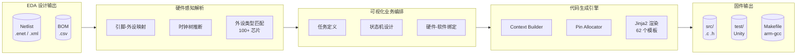
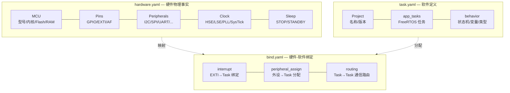
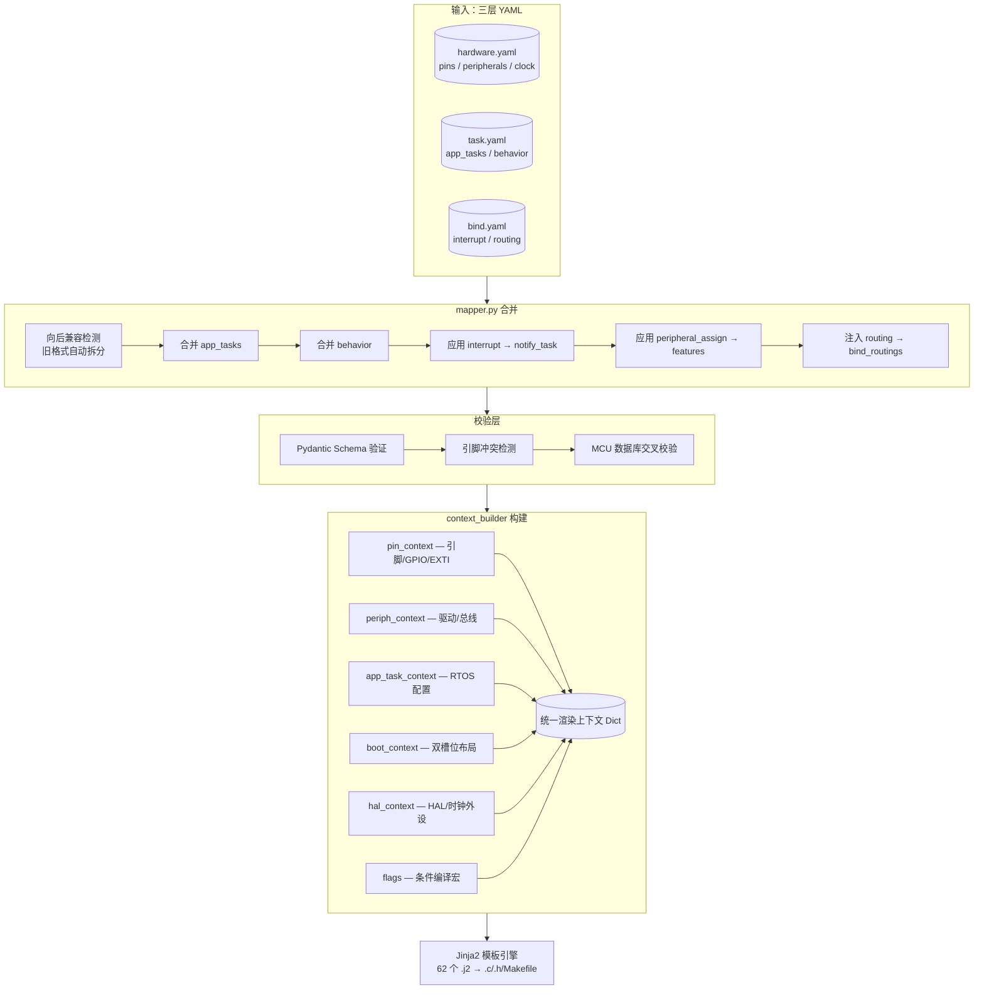

# Hardware2Code

**从 EDA 设计文件到可编译嵌入式固件，一键直达。**

[](LICENSE)
[](https://python.org)
[](https://www.st.com)
[](https://freertos.org)

---

## 行业痛点

传统嵌入式开发中，硬件定型后工程师仍需要数周时间完成驱动编写、RTOS 任务搭建和状态机实现。**更致命的是**，这些代码与硬件设计脱节——引脚不对、AF 复用冲突、时钟配置错误等问题几乎出现在每一个项目中。

| 痛点 | 传统方式 | hw2c 方案 |
|------|----------|-----------|
| 硬件→软件信息断层 | 手动对照原理图写 init 代码 | 直接解析 Netlist/BOM，自动映射引脚-外设 |
| 驱动代码重复编写 | 每项目复制粘贴 GPIO/UART/SPI 模板 | 外设模型库驱动，按需渲染 MISRA C 代码 |
| 业务逻辑调试低效 | 无状态机框架，if-else 嵌套失控 | 层级状态机 DSL，可视化编排，自动生成 C |
| 测试依赖硬件 | 烧录→看现象→改代码循环 | PC 端 Unity 单元测试 + Mock HAL，脱离硬件验证 |
| 硬件变更→软件适配 | 改原理图后手动改代码 | 重新生成，diff 仅业务逻辑 |

---

## 核心流程



> **一句话**：上传网表和 BOM，拖拽编排任务和绑定，下载 arm-none-eabi-gcc 可直接编译的嵌入式工程。

---

## 三层 YAML 架构

项目采用 **硬件 / 软件 / 绑定** 三层解耦设计，各层职责独立、可并行编辑：



### 上下文构建流程

三份 YAML 通过 `mapper.py` 合并为统一的模板渲染上下文：



> 无论旧格式（单体 YAML）还是新格式（三层拆分），`mapper.py` 确保上游零改动。

---

## 特性一览

| 类别 | 能力 |
|------|------|
| **硬件解析** | EasyEDA Pro `.enet` / KiCad XML / S-Expr 网表，CSV BOM，100+ 外设芯片启发式匹配 |
| **驱动生成** | GPIO、EXTI、I2C、SPI、ADC、PWM、RTC、UART、IWDG、RS485、红外、EEPROM — 17 种驱动模板 |
| **业务 DSL** | 层级状态机（复合子状态 / 并行区域 / 历史状态）、defer/timeline 时间控制、when 条件动作、ref 引用复用 |
| **任务系统** | FreeRTOS 任务定义 + 优先级/栈配置，可视化拖拽绑定中断源与外设 |
| **低功耗** | 自动唤醒源分析，Tickless Idle 钩子，STOP/STANDBY/SLEEP 支持 |
| **Bootloader** | 双槽位 A/B，硬件 CRC32，TAMP 备份寄存器，启动失败自动回退 |
| **FOTA** | BSDIFF 差分升级，减小 OTA 传输体积，完整性校验 + 回滚 |
| **测试** | Unity 框架 + Mock HAL，PC 端脱离硬件运行，覆盖率报告 |
| **通信** | Modbus RTU / MQTT 3.1.1 / RS485 半双工 / Cellular 4G Cat.1 |
| **工具链** | `arm-none-eabi-gcc` + Makefile，VSCode launch/tasks 自动生成，ST-Link + DAP-Link 烧录 |

---

## 快速开始

```bash
# 1. 克隆并安装
git clone --recurse-submodules https://github.com/jinliangliu/hw2c.git
cd hw2c && pip install -e .

# 2. 从网表生成硬件描述
hw2c parse parser/hardware_design/stm32g0b1_demo.enet \
    --bom parser/hardware_design/stm32g0b1_demo.csv \
    -o hardware.yaml --task task.yaml

# 3. 编辑 task.yaml / bind.yaml（或用 Web 前端辅助）

# 4. 一键生成工程
hw2c gen -i hardware.yaml --task task.yaml --bind bind.yaml -o output/my_project

# 5. 编译烧录
cd output/my_project && make && make flash
```

> Web 可视化配置台：[hw2c-web](https://github.com/jinliangliu/hw2c-web) — 提供拖拽式任务编排、引脚封装预览、时钟树配置与 YAML 实时编辑。

---

## 支持矩阵

### MCU

| 系列 | 型号 | 内核 | Flash | RAM | 状态 |
|------|------|------|-------|-----|------|
| STM32G0 | STM32G0B1RE | Cortex-M0+ | 512 KB | 144 KB | 已验证 |

### 外设覆盖

| 外设 | 驱动 | 单元测试 | 业务示例 |
|------|------|----------|----------|
| GPIO + EXTI | `gpio.c` | `test_gpio.c` | `blinky_g0` |
| USART | `drv_uart.c`, `drv_log.c` | `test_uart.c` | `cli_demo` |
| I2C MPU6050 | `drv_i2c_mpu6050.c` | `test_mpu6050.c` | `mpu6050` |
| SPI W25Q32 | `drv_spi_flash.c` | `test_spi_flash.c` | `spi_flash` |
| ADC | `drv_adc.c` | `test_adc.c` | `adc_uart` |
| PWM | `drv_pwm.c` | `test_pwm.c` | `pwm` |
| RTC | `drv_rtc.c` | `test_rtc.c` | `rtc_advanced` |
| IWDG | `drv_iwdg.c` | — | `bootloader_demo` |
| RS485 | `drv_rs485.c` | — | `modbus_demo` |
| Cellular 4G | `drv_cellular.c` | — | `cellular_mqtt` |
| 红外 NEC/SIR | `drv_ir.c` | — | — |
| I2C EEPROM | `drv_eeprom.c` | — | `i2c_spi_demo` |

### 状态机 DSL

```yaml
behavior:
  initial_state: IDLE
  states:
    - name: IDLE
      transitions:
        - { event: BTN_PRESS, target: ACTIVE }
    - name: ACTIVE
      entry: set(led, on)
      exit:  set(led, off)
      transitions:
        - { event: BTN_RELEASE, target: IDLE }
```

完整参考：[task-yaml.md](docs/user-guide/task-yaml.md) | [bind-yaml.md](docs/user-guide/bind-yaml.md)

---

## 目录

```
hw2c
├── parser/          # 网表/BOM 解析管线
├── generator/       # 代码生成引擎（mapper / context / schemas / builders）
├── templates/       # 62 个 Jinja2 模板（驱动 / 测试 / 配置 / 链接脚本）
├── models/          # 17 个外设模型 YAML
├── examples/        # 22 个示例项目（从 blinky 到 FOTA）
├── docs/            # MkDocs 文档（用户指南 / 开发者指南 / 路线图）
├── static/          # Git 子模块（HAL / CMSIS / FreeRTOS / Unity）
└── tests/           # 78 个生成器单元测试
```

---

## 路线图

| 里程碑 | 内容 |
|--------|------|
| v0.5 | 多 MCU 后端支持（ESP32、NXP） |
| v0.6 | `bind.yaml` 事件系统完整实现，Web 前端 BindGraph 联动 |
| v1.0 | 免编程工作流闭环，EDA 上传 → 拖拽编排 → 一键固件 |

详见：[ROADMAP.md](ROADMAP.md) | [three-layer-split.md](docs/plans/three-layer-split.md)

---

## 许可证

MIT © hw2c contributors
