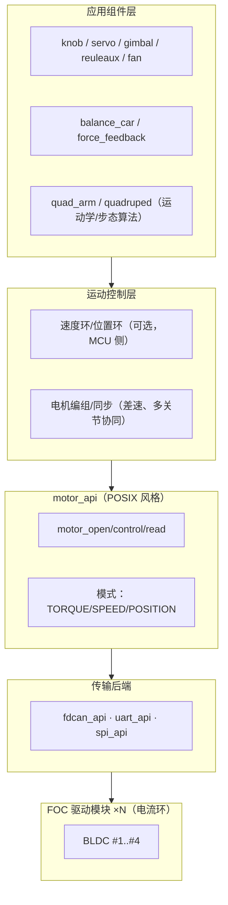

# FOC 多电机控制规划（HW2C-DevKit FOC 扩展）

> 状态：规划中 · 目标：hw2c 支持最多 4 个无刷电机的独立 FOC 控制，
> 并提供单/双/四电机的应用映射（Knob / 舵机 / 云台 / 莱洛三角 / 静音风扇 /
> 平衡车 / 力反馈摇杆 / 四轴机械臂 / 四足）。

## 1. 需求与目标

- **多电机**：硬件与软件均支持 1..4 个无刷电机（BLDC/PMSM），可配置
- **独立控制**：任意一个电机可独立运行在力矩 / 速度 / 位置三种模式
- **应用映射**（同一套电机抽象上的不同应用组件）：

| 电机数 | 应用 |
|--------|------|
| 1 | 力矩反馈阻尼旋钮 Knob · 单关节模块化舵机 · 单轴防抖云台 · 自平衡莱洛三角 · 无感 FOC 静音风扇 |
| 2 | 差速两轮平衡车 · 双轴力反馈摇杆 |
| 4 | 四轴机械臂（4 关节）· 简化四足（每腿 1 主动关节） |

## 2. 硬件方案评估（基于 STM32G0B1RE）

### MCU 资源盘点

| 资源 | G0B1RE 现状 | FOC 需求 |
|------|------------|----------|
| 高级定时器（互补 PWM + 刹车） | 仅 TIM1（6 通道 = 1 组三相） | 1 组三相/电机 |
| 通用定时器 | TIM3/TIM15/TIM16/TIM17（无互补） | 辅助编码器/触发 |
| ADC | ADC1（16 通道） | 3 路电流采样/电机 |
| FDCAN | FDCAN1 ✓ | 多电机总线（推荐） |
| UART | USART1..6 + LPUART1 | 1~2 电机直连（可用） |
| DMA | DMA1/2 + DMAMUX | 电流采样/总线 |

### 结论：G0B1 直驱 4 路 FOC 资源不足

标准"MCU 直驱"每路 FOC 需要 3 对互补 PWM + 3 路电流采样 + 编码器/霍尔
接口，4 路共需 4 个高级定时器——G0B1RE 只有 1 个。**执行层采用
"每电机一个集成 FOC 驱动模块"**：

```text
STM32G0B1RE（运动控制大脑）
  └─ FDCAN1（推荐，一条总线挂 4 节点，ID/优先级适合实时控制）
  └─ USART1/2（1~2 电机直连，简单模块）
  └─ SPI1（短距低延迟，每电机一个 CS）
        ├─ FOC 模块 #1 ── BLDC #1（电流环在模块内）
        ├─ FOC 模块 #2 ── BLDC #2
        ├─ FOC 模块 #3 ── BLDC #3
        └─ FOC 模块 #4 ── BLDC #4
```

FOC 模块（如 TMC4671、峰岹 FU68xx、DRV 系列 + 自带 MCU 的驱动器、
SimpleFOC 配套板等）负责电流环/换相，MCU 负责运动控制与应用逻辑。
该分层与 hw2c"软硬件分离"一致：**未来换 MCU 或改直驱，只换驱动层后端**。

## 3. 软件架构（分层）



### motor_api（核心抽象，镜像 uart_api/i2c_api 模式）

```c
typedef struct motor_dev *motor_handle_t;

typedef enum {
    MOTOR_MODE_TORQUE,     /* 电流/力矩闭环（模块内电流环） */
    MOTOR_MODE_SPEED,      /* 速度闭环 */
    MOTOR_MODE_POSITION,   /* 位置闭环 */
    MOTOR_MODE_DISABLED,
} motor_mode_t;

motor_handle_t motor_open(const char *name, const motor_cfg_t *cfg);
int  motor_set_mode(motor_handle_t h, motor_mode_t mode);
int  motor_set_target(motor_handle_t h, float target);   /* N·m / rad/s / rad */
int  motor_read(motor_handle_t h, motor_state_t *out);   /* 电流/速度/位置/温度 */
int  motor_set_pid(motor_handle_t h, motor_pid_t *pid);  /* 可选，速度/位置环 */
int  motor_calibrate(motor_handle_t h);                  /* 编码器零位/相序 */
```

每电机一个 `foc_motor` 组件实例（复用组件框架多实例能力，同 led/btn）；
应用组件（knob/balance_car/...）通过 motor_api 驱动一组电机并做协同算法。

## 4. 六层 YAML 设计（草案）

### hardware.yaml（FOC 外设）

```yaml
peripherals:
  # 4 个集成 FOC 电机模块挂在同一条 FDCAN 总线上
  - name: fdc
    type: FDCAN_Bus
    instance: FDCAN1
    extra:
      bitrate: 1000000

  - name: motor1
    type: FOC_Motor
    bus: fdc
    node_id: 1
    extra:
      mode: POSITION
      pole_pairs: 7
      encoder: magnetic     # 或 hall / sensorless
      current_max_a: 3.0
      velocity_max_radps: 12.0
  # motor2..motor4 同构（node_id 2..4）
```

### components.yaml（每电机一个组件 + 应用组件）

```yaml
components:
  - name: m1
    type: foc_motor
    driver: fdc
    period_ms: 1            # 1 kHz 运动控制
    config: { motor: motor1, mode: POSITION }
  # m2..m4 同构
  - name: knob
    type: force_knob        # 单电机应用：力矩反馈阻尼旋钮
    period_ms: 1
    config: { motor: m1, damping: 0.05, friction: 0.02 }
```

### params.yaml（控制参数运行时调参）

```yaml
params:
  - { name: knob_damping,     component: knob, type: float, default: 0.05 }
  - { name: balance_car_tilt_kp, component: balance_car, type: float, default: 2.0 }
  - { name: balance_car_tilt_kd, component: balance_car, type: float, default: 0.2 }
```

### task.yaml / pubsub.yaml

- 状态机：应用状态（例如平衡车：MANUAL / BALANCING / SAFE_STOP）、
  电机故障事件（FAULT_* → 安全停机）
- pubsub：电机状态（位置/速度/力矩）、IMU 倾角 → 平衡/云台应用

## 5. 应用矩阵与控制要点

| 应用 | 电机 | 控制模式 | 关键算法（纯 C 可测模块） |
|------|------|----------|---------------------------|
| Knob | 1 | POSITION+TORQUE | 阻尼/摩擦/惯量补偿，力矩反馈（力觉） |
| 模块化舵机 | 1 | POSITION | 位置环 + 限位 + 力矩保护 |
| 单轴云台 | 1 | TORQUE | IMU 姿态 → 扰动补偿（roll 抵消） |
| 莱洛三角 | 1 | TORQUE | 单电机自平衡：倾角反馈 → 扭矩（类倒立摆） |
| 无感风扇 | 1 | SPEED（无感） | 速度环 + 启动/堵转保护，静音换相 |
| 差速平衡车 | 2 | TORQUE | IMU 倾角 + 两轮差速：直行/转向解耦 |
| 双轴力反馈摇杆 | 2 | POSITION+TORQUE | 双轴阻尼/复位力，位姿→力矩映射 |
| 四轴机械臂 | 4 | POSITION | 平面/空间逆运动学（IK），关节限位与插补 |
| 四足（简化） | 4 | POSITION | 步态时序（对角小跑），腿关节同步 |

## 6. 分阶段路线

### 阶段 1：motor_api + 单电机（1 电机）

- 实现 `motor_api`（FDCAN 后端优先）与 `foc_motor` 组件
- 应用：Knob（力矩反馈阻尼旋钮，最容易验证力觉）→ 无感风扇（速度环）→
  单轴云台（IMU 协同，复用现有姿态）
- 验证：位置/速度/力矩三模式切换，CLI `motor` 命令

### 阶段 2：双电机协同

- 电机编组/同步，`balance_car`（IMU + 差速）与 `force_feedback`（双轴）
- 验证：平衡车站立/转向，摇杆双轴力觉

### 阶段 3：四电机

- `quad_arm`（4 关节 IK）与 `quadruped`（步态时序）
- 验证：机械臂点到点运动、四足对角小跑

## 7. 风险与开放问题

- **FOC 模块协议**：不同厂商（TMC/峰岹/自制 SimpleFOC）协议不同——
  motor_api 需按模块族参数化（模板选择后端），建议优先支持一个参考模块
- **实时性**：1 kHz 运动控制 + FDCAN 中断 + 多电机，G0B1 M0+ 负载需实测；
  必要时降频（500 Hz）或将速度/位置环下放到模块
- **编码器**：磁编码器（如 MT6701/AS5600）为主，霍尔/无感作为配置项
- **安全**：电机故障 → 立即安全停机（FAULT 事件 → 状态机 SAFE_STOP），
  必须硬件级冗余（驱动器 ENABLE/刹车）
- **四足/机械臂运动学**：作为纯 C 算法模块（同 attitude/fall_detect 模式），
  主机侧可测，上板只调参数
- **HW2C-DevKit 硬件**：FOC 扩展板（电机接口 ×4 + FDCAN 收发器 + 编码器
  接口），与主控板分离设计
